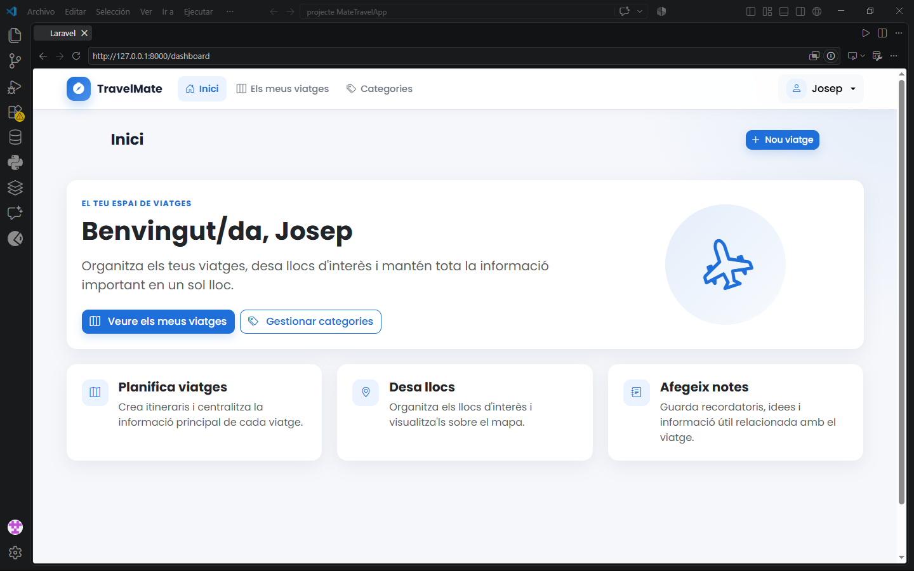
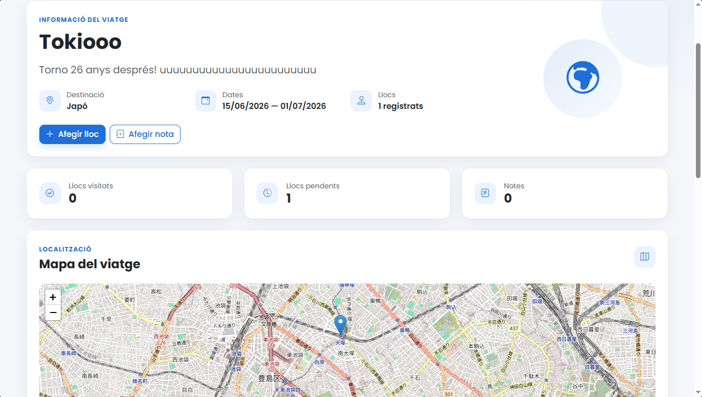

# ✈️ TravelMate

**TravelMate** is a web application for planning and managing trips, developed with **PHP and Laravel**.

The application allows users to organise their trips, manage places they want to visit, classify them into categories, add notes and visualise locations on an interactive map.

The project was developed as a practical full-stack application, focusing on MVC architecture, relational data modelling, authentication, authorisation and CRUD operations.

## 📸 Screenshots

### Trip management



### Trip details and interactive map



## ✨ Features

- User registration and authentication
- Personal trip management
- Create, edit and delete trips
- Manage places associated with each trip
- Mark places as visited
- Organise places using custom categories
- Add notes to trips
- Interactive maps with Leaflet and OpenStreetMap
- Location search and geographic coordinates
- Links to locations in Google Maps
- User-specific data protection
- Form validation and error handling
- Responsive web interface

## 🛠️ Technologies

### Backend
- PHP
- Laravel
- Laravel Eloquent ORM
- Laravel Breeze

### Frontend
- Blade
- HTML5
- CSS3
- JavaScript
- Bootstrap 5
- Vite

### Maps and geolocation
- Leaflet
- OpenStreetMap
- Nominatim

### Database
- MySQL

### Development and testing
- Composer
- npm
- Git
- PHPUnit / Laravel Feature Tests

## 🏗️ Architecture

TravelMate follows Laravel's **MVC architecture**:

```text
Browser
   │
   ▼
Routes
   │
   ▼
Controllers
   │
   ▼
Models / Eloquent ORM
   │
   ▼
MySQL Database

Controllers
   │
   ▼
Blade Views
   │
   ▼
HTML / CSS / JavaScript
```

The main domain entities are:

- **Trip** — represents a user's trip
- **Place** — locations associated with a trip
- **Category** — user-defined categories for organising places
- **Note** — notes associated with trips
- **User** — authenticated application users

Relationships between these entities are managed using **Eloquent ORM**.

## 🔐 Authentication and authorisation

The application includes user registration, login and profile management.

Resources are associated with individual users, and access control is applied so users can only manage their own trips, categories, places and notes.

## 🗺️ Maps and location management

TravelMate integrates **Leaflet and OpenStreetMap** to display trip locations on an interactive map.

Places can store geographic coordinates and are represented using map markers. Location search is integrated using OpenStreetMap's **Nominatim** service.

## 🧪 Testing

The project includes Laravel feature tests covering authentication and user account functionality.

Current test suite:

- **25 tests**
- **61 assertions**

Tests can be executed with:

```bash
php artisan test
```

## 🚀 Running the project

### Requirements

- PHP
- Composer
- Node.js / npm
- MySQL

Clone the repository:

```bash
git clone https://github.com/JosepRC80/TravelMate.git
cd TravelMate
```

Install PHP dependencies:

```bash
composer install
```

Install frontend dependencies:

```bash
npm install
```

Create the environment configuration:

```bash
cp .env.example .env
```

On Windows PowerShell:

```powershell
Copy-Item .env.example .env
```

Generate the application key:

```bash
php artisan key:generate
```

Configure your database connection in `.env`, then run:

```bash
php artisan migrate
```

Start the Laravel development server:

```bash
php artisan serve
```

In a second terminal, start Vite:

```bash
npm run dev
```

Then open:

```text
http://127.0.0.1:8000
```

## 🎯 What I worked on

This project allowed me to practise and consolidate:

- Full-stack web application development
- PHP and Laravel
- MVC architecture
- CRUD operations
- Relational database modelling
- Eloquent ORM and model relationships
- Authentication and authorisation
- Request validation
- Resource ownership and access control
- Blade templates
- JavaScript integration
- Interactive maps and external services
- Git-based version control
- Feature testing

## 👤 Author

**Josep Riego Cladera**

Developed as a personal project and as part of my learning in Web Application Development.